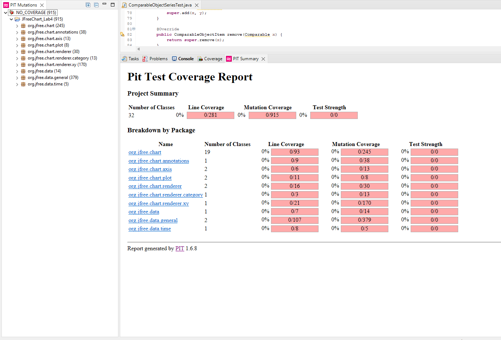

**SENG 637 - Dependability and Reliability of Software Systems**

**Lab. Report \#4 – Mutation Testing and Web app testing**

| Group #: 14     |     |
| -------------- | --- |
| **Student Names:** |     |
| Ayodele Oluwabusola |     |
| Gabriel Gabari |     |
| Remi Oyediji   |     |
| Taiwo Oyewole  |     |

# Introduction
Building upon the foundations established in our previous labs, this report details our exploration of advanced testing techniques, specifically mutation testing and web application testing. As a continuation of the previous labs, in this lab, we're doing two types of software testing. First, we're using Pitest to see how good our old tests are at finding bugs in the `Range` and `DataUtilities` code. We'll try to make our tests better so they catch more bugs (increase the "mutation score").

Second, we're using Selenium to test "Air Canada" website. We'll create tests to check if different parts of the website work correctly.

You can find the website tests in the root folder (.side files), and the updated bug-finding tests in the "org.jfree.data" part of the "JFreeChart_Lab4" folder. 

# Analysis of 10 Mutants of the Range class 

# Report all the statistics and the mutation score for each test class

By introducing small code changes (mutants), the test suite was evaluated to see how many mutants were killed (caught by tests) and how many survived (escaped detection).

## For DataUtitlities Test

**Mutation Summary**
- Total Mutants Generated: 279
- Mutants Killed: 26
- Mutants Survived: 253
- Mutants with NO_COVERAGE: 253

**Covered Mutations**
Some mutations were killed by the tests, indicating that certain aspects of the code were effectively tested. Key areas covered include:

- Handling of null arrays.
- Cloning and modifying 2D arrays.
- Calculating column and row totals with edge cases.
- Handling of arrays with NaN and Infinity values.

**Surviving Mutants (NO_COVERAGE)**
A significant number of mutants survived, indicating gaps in test coverage. The uncovered areas include:

Removal of method calls (getItemCount, getValue, etc.).
- Boundary and conditional changes (< to <=, == to !=).
- Substitution of constants (0 to 1, 0.0 to 1.0, etc.).
- Negation and increment/decrement operations on local variables.
- Replacement of double operations (addition, multiplication, etc.).
- Null and exception return mutations.

**Identified Weak Spots**
- Conditional Boundaries: Mutations that changed less than to greater than, equal to or not equal survived.
- Double and Integer Operations: Many substitutions and arithmetic mutations went undetected.
- Null Handling and Method Calls: Removed method calls (getItemCount, getValue) were not caught by existing tests.
- Return Value Changes: Mutants that replaced return values with null or exceptions escaped detection.

# Analysis drawn on the effectiveness of each of the test classes

# A discussion on the effect of equivalent mutants on mutation score accuracy

# A discussion of what could have been done to improve the mutation score of the test suites

# Why do we need mutation testing? Advantages and disadvantages of mutation testing

# Explain your SELENUIM test case design process

# Explain the use of assertions and checkpoints

# how did you test each functionaity with different test data

# How the team work/effort was divided and managed

# Difficulties encountered, challenges overcome, and lessons learned

# Comments/feedback on the assignment itself
