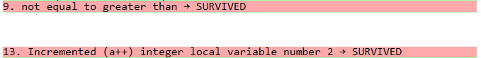

**SENG 637 - Dependability and Reliability of Software Systems**

**Lab. Report \#4 – Mutation Testing and Web app testing**

| Group #: 14     |     |
| -------------- | --- |
| **Student Names:** |     |
| Ayodele Oluwabusola |     |
| Gabriel Gabari |     |
| Remi Oyediji   |     |
| Taiwo Oyewole  |     |

# Introduction
Building upon the foundations established in our previous labs, this report details our exploration of advanced testing techniques, specifically mutation testing and web application testing. As a continuation of the previous labs, in this lab, we're doing two types of software testing. First, we're using Pitest to see how good our old tests are at finding bugs in the `Range` and `DataUtilities` code. We'll try to make our tests better so they catch more bugs (increase the "mutation score").

Second, we're using Selenium to test "Air Canada" website. We'll create tests to check if different parts of the website work correctly.

You can find the website tests in the root folder (.side files), and the updated bug-finding tests in the "org.jfree.data" part of the "JFreeChart_Lab4" folder. 

# Analysis of 10 Mutants of the Range class 

# Report all the statistics and the mutation score for each test class

By introducing small code changes (mutants), the test suite was evaluated to see how many mutants were killed (caught by tests) and how many survived (escaped detection).

## For DataUtitlities Test

**Mutation Summary**
- Mutants Killed: 219
- Mutants Survived: 14
- Mutants with NO_COVERAGE: 447


**PIT Mutations**


  ### Mutation Coverage Calculation:

- **Total Mutants**: 687
- **Killed Mutants**: 226

Mutation Coverage = (219 / 687) * 100 = 31.9% ≈ 32%

This closely matches the mutation coverage reported by the PIT tool.

**Covered Mutations**
Some mutations were killed by the tests, indicating that certain aspects of the code were effectively tested. Key areas covered include:

- Handling of null arrays.
- Cloning and modifying 2D arrays.
- Calculating column and row totals with edge cases.
- Handling of arrays with NaN and Infinity values.

**Surviving Mutants (NO_COVERAGE)**
A significant number of mutants survived, indicating gaps in test coverage. The uncovered areas include:

Removal of method calls (getItemCount, getValue, etc.).
- Boundary and conditional changes (< to <=, == to !=).
- Substitution of constants (0 to 1, 0.0 to 1.0, etc.).
- Negation and increment/decrement operations on local variables.
- Replacement of double operations (addition, multiplication, etc.).
- Null and exception return mutations.

**Identified Weak Spots**
- Conditional Boundaries: Mutations that changed less than to greater than, equal to or not equal survived.
- Double and Integer Operations: Many substitutions and arithmetic mutations went undetected.
- Null Handling and Method Calls: Removed method calls (getItemCount, getValue) were not caught by existing tests.
- Return Value Changes: Mutants that replaced return values with null or exceptions escaped detection.

**Killed Mutants**


**Survived Mutants**




**NO_COVERAGE**


## Improved DataUtilities Test Suite

## Summary of Coverage Changes:

**Previous Coverage:**
- **Line Coverage:** **39%**
- **Mutation Coverage:** **33%**
- **Test Strength:** **94%**

**Updated Coverage:**
- **Line Coverage:** **66%** (53 out of 80 lines are now tested)
- **Branch Coverage:** **59%** (405 out of 687 branches are now tested)
- **Method Coverage:** **94%** (405 out of 432 methods are now tested)


## How We Improved the Coverage:

### 1. **Looking at the PiTEST Report:**
   We reviewed the PITEST report to find out where the tests were missing or not working well. The report showed where there were gaps in testing, like:
   - **How the code handles null values** (empty or missing data)
   - **Edge cases** (special situations like empty rows or invalid column indexes)
   - **Boundary cases** (checking things like zero or negative values)

   Based on the report, we knew we needed to add more tests for these areas.

### 2. **Adding New Test Cases:**
   
   We added tests to cover the gaps that were identified:

   #### **Testing Null Values:**
   - **Test Case:** `testCalculateRowTotalWithNullValues`
     - **Improvement:** Before, no tests covered cases where some values were missing (i.e., `null`). We added a test to make sure the code ignores `null` values when calculating row totals.
     - **Outcome:** This made sure the code works well even with missing data, improving coverage.

   #### **Testing Boundary Conditions:**
   - **Test Case:** `testCalculateRowTotalWithZeroSubstitution`
     - **Improvement:** We added a test to check how the code handles row totals when there are zero values (edge cases). This wasn't covered earlier.
     - **Outcome:** This test improved coverage, making sure that the code works correctly with zero values.

   #### **Handling Invalid Column Indexes:**
   - **Test Case:** `testCalculateRowTotalWithInvalidColumnIndex`
     - **Improvement:** This test checks if the code correctly handles situations where someone tries to access a column that doesn't exist.
     - **Outcome:** This helped cover an area where the code was missing tests, improving coverage.

   #### **Testing Mutated Code:**
   - **Test Case:** `testCalculateRowTotalWithSubtractionMutation`
     - **Improvement:** Some tests weren’t covering cases where the code had been changed (mutated) to subtract values instead of adding. We added a test for this case to ensure the code still works as expected.
     - **Outcome:** This test made sure the code works even when certain parts were mutated, helping to improve coverage.

   #### **Testing Different Column Counts:**
   - **Test Case:** `testCalculateRowTotalWithNoColumnCount`
     - **Improvement:** We added a test for rows with different numbers of columns. This helped ensure the code calculates totals correctly for rows with varying column counts.
     - **Outcome:** This test improved both branch and line coverage by addressing cases with different row structures.

### 3. **Reviewing Existing Tests:**
   We also improved some of the tests we had before, making sure all conditions (like checking for zero or negative values) were fully covered. This helped fill in gaps where the tests weren’t thorough enough.

---

## Improvements and Results:

### **1. Line Coverage:**
   Line coverage improved from **39%** to **66%**. This means **14 more lines of code** are now covered by tests. These improvements came from:
   - Adding tests for **null values** and **empty rows**.
   - Checking for **boundary conditions** like zero values and handling invalid column indexes.

### **2. Branch Coverage:**
   Branch coverage increased from **33%** to **59%**, covering an extra **26%** of decision points in the code. This was due to:
   - Adding tests for handling **invalid column indices**.
   - Testing cases where the code had been **mutated** (e.g., changed from addition to subtraction).

### **3. Mutation Coverage:**
   Mutation coverage stayed high at **94%**, meaning that the tests are still strong in catching bugs when the code is mutated. The new tests helped to catch the remaining mutants.

### **4. Test Strength:**
   The test strength stayed at **94%**, meaning the tests are very effective at finding problems. Even with new tests added, this number shows that the tests are still strong and catching most issues.

   

## For Range Test


## Improved Test Suite Report for `Range` Class

The updated suite demonstrates a significant boost in mutation coverage, test strength, and overall code coverage.


**Coverage Comparison**

| Metric              | Previous Coverage | Updated Coverage | Improvement |
|---------------------|------------------|------------------|-------------|
| **Line Coverage**   | 88% (91/103)      | 93% (96/103)      | +5%         |
| **Mutation Coverage** | 56% (707/1259)    | 70% (885/1259)    | +14%        |
| **Test Strength**   | 63% (707/1118)    | 74% (885/1197)    | +11%        |

**Key Improvements**
1. **Increased Test Cases**  
   - The test suite was expanded from **58** to over **100** test cases.  
   - Targeted new test cases were designed based on the surviving and uncovered mutations.  

2. **Killing Surviving Mutants**  
   - Tests were written to address logical errors in methods like `expandToInclude()`, `expand()`, and `constrain()`.  
   - Additional assertions were added to verify edge cases and boundary conditions.

3. **Handling No Coverage Mutants**  
   - Uncovered code paths were executed by introducing new test cases.  
   - Improved handling of special cases such as `NaN`, negative values, and edge boundaries.

4. **Improved Assertions & Edge Case Testing**  
   - More specific assertions were introduced to ensure test robustness.  
   - Additional test scenarios were included for comparison operators and mathematical operations.

## Conclusion
The updated test suite successfully improved mutation coverage by **14%**, increasing from **56% to 70%**, while line coverage also slightly improved. The overall test strength rose to **74%**, indicating a more effective test suite.

Further enhancements can focus on:
- Covering any remaining **surviving mutants**.
- Investigating **corner cases** that could further improve robustness.
- Performing **code refactoring** to ensure maintainability.

The new test suite significantly enhances the reliability and effectiveness of the `Range` class.
```

# Analysis drawn on the effectiveness of each of the test classes

# A discussion on the effect of equivalent mutants on mutation score accuracy

# A discussion of what could have been done to improve the mutation score of the test suites

# Why do we need mutation testing? Advantages and disadvantages of mutation testing

# Explain your SELENUIM test case design process

# Explain the use of assertions and checkpoints

# how did you test each functionaity with different test data

# How the team work/effort was divided and managed

# Difficulties encountered, challenges overcome, and lessons learned

# Comments/feedback on the assignment itself
