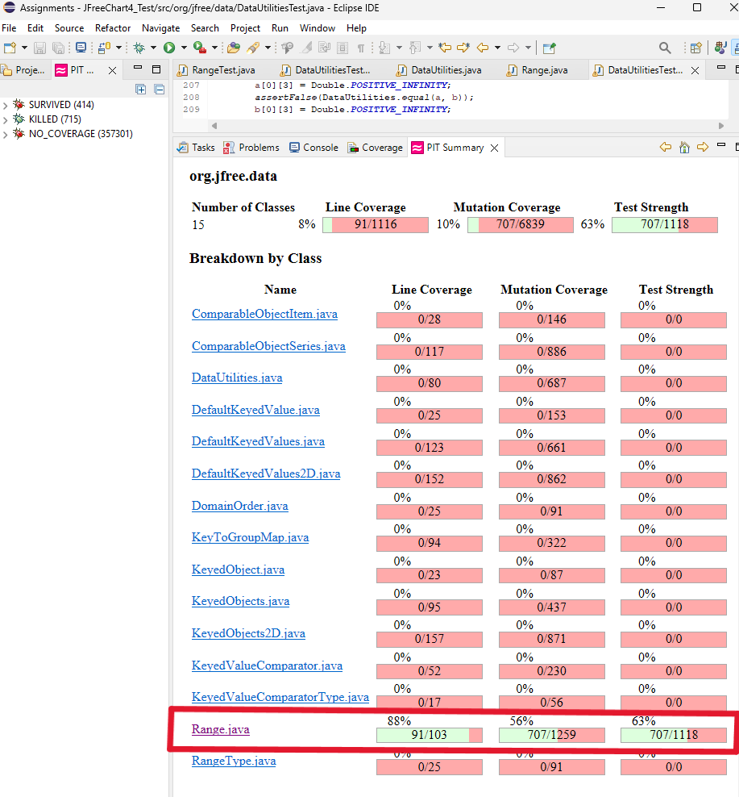

**SENG 637 - Dependability and Reliability of Software Systems**

**Lab. Report \#4 – Mutation Testing and Web app testing**

| Group #: 14     |     |
| -------------- | --- |
| **Student Names:** |     |
| Ayodele Oluwabusola |     |
| Gabriel Gabari |     |
| Remi Oyediji   |     |
| Taiwo Oyewole  |     |

# Introduction
Building upon the foundations established in our previous labs, this report details our exploration of advanced testing techniques, specifically mutation testing and web application testing. As a continuation of the last lab, in this lab, we're doing two types of software testing. First, we're using Pitest to see how good our old tests are at finding bugs in the `Range` and `DataUtilities` code. We'll try to make our tests better so they catch more bugs (increase the "mutation score").

Second, we're using Selenium to test "Air Canada" website. We'll create tests to check if different parts of the website work correctly.

You can find the website tests in the root folder (.side files), and the updated bug-finding tests in the "org.jfree.data" part of the "JFreeChart_Lab4" folder. 

# Analysis of 10 Mutants of the Range class 

**1. Mutation in `expand()` Method (Survived)**  
In the `expand(Range range, double lowerMargin, double upperMargin)` method, the mutant replaced the averaging operation:

```java
// Original
lower = lower / 2.0 + upper / 2.0;

// Mutated
lower = lower;
```

This mutation ignores `upper` when recalculating the midpoint, affecting cases where `lower > upper` after expansion. Since the mutant survived, it suggests that the test suite does not explicitly verify scenarios where `lower` and `upper` require recalculation after inversion. Adding tests to cover such conditions would kill this mutant.

---

**2. Mutation in `scale()` Method (Survived)**  
In the `scale(Range range, double factor)` method, the mutant modified the boundary condition:

```java
// Original
if (factor < 0) {
    throw new IllegalArgumentException("Factor must be non-negative.");
}

// Mutated
if (factor <= 0) {
    throw new IllegalArgumentException("Factor must be non-negative.");
}
```

The mutation altered the strictness of the condition, potentially allowing zero as a valid `factor`. The survival of this mutant indicates that the test suite lacks tests to verify boundary conditions for negative and zero scaling factors.

---

**3. Mutation in `equals()` Method (Survived)**  
The mutation in `equals(Object obj)` removed the logical negation of the `instanceof` check, allowing incorrect types to pass the comparison:

```java
// Original
if (!(obj instanceof Range)) {
    return false;
}

// Mutated
if ((obj instanceof Range)) {
    return false;
}
```

This mutant survived, suggesting that the test suite does not verify that comparisons with non-`Range` objects correctly return `false`. Adding tests to compare `Range` with incompatible types would kill this mutant.

---

**4. Mutation in `isNaNRange()` Method (Survived)**  
The mutant incremented the `lower` value before checking if both bounds are NaN:

```java
// Original
return Double.isNaN(this.lower) && Double.isNaN(this.upper);

// Mutated
return Double.isNaN(this.lower++) && Double.isNaN(this.upper);
```

This mutation alters the correctness of the NaN check. Its survival indicates that the test suite does not sufficiently verify that `isNaNRange()` correctly identifies NaN ranges. Additional tests should cover cases where one or both bounds are modified before the NaN check.

---

**5. Mutation in `getCentralValue()` Method (Survived)**  
In `getCentralValue()`, the mutant decremented `lower` before calculating the midpoint:

```java
// Original
return this.lower / 2.0 + this.upper / 2.0;

// Mutated
return this.lower-- / 2.0 + this.upper / 2.0;
```

The mutation changes the midpoint, potentially leading to incorrect results. Since this mutant survived, the test suite may not include boundary tests for verifying the midpoint calculation under variations of `lower` and `upper` values.

---

**6. Mutation in `getUpperBound()` Method (Killed)**  
The mutation decremented `upper` before returning its value:

```java
// Original
return this.upper;

// Mutated
return this.upper--;
```

The mutation was killed, indicating that the test suite effectively verifies the correctness of the `getUpperBound()` method. This suggests that boundary tests for the upper bound are well-covered.

---

**7. Mutation in `getCentralValue()` Method (Killed)**  
A mutant negated `upper` before calculating the midpoint:

```java
// Original
return this.lower / 2.0 + this.upper / 2.0;

// Mutated
return this.lower / 2.0 + (-this.upper) / 2.0;
```

The test suite successfully killed this mutant by detecting changes in the midpoint calculation when the upper bound was negated. Tests validating the midpoint calculation handled this mutant effectively.

---

**8. Mutation in `intersects()` Method (Survived)**  
In `intersects(double b0, double b1)`, the mutant altered the boundary condition:

```java
// Original
if (b0 <= this.lower)

// Mutated
if (b0 >= this.lower)
```

This mutation changes the logic for determining intersections, potentially causing the method to misidentify intersection conditions. Since the mutant survived, additional boundary tests for intersection logic should be added.

---

**9. Mutation in `shiftWithNoZeroCrossing()` Method (Survived)**  
A mutant in `shiftWithNoZeroCrossing(double value, double delta)` altered the condition that prevents zero-crossing:

```java
// Original
if (value > 0.0)

// Mutated
if (value >= 0.0)
```

The mutant changes the boundary condition, potentially allowing unintended zero-crossing behavior. Its survival suggests that tests verifying zero-crossing prevention for positive values should be included.

---

**10. Mutation in `shiftWithNoZeroCrossing()` Method (Survived)**  
In the same method, another mutant replaced the conditional check with a hardcoded `false`, effectively bypassing the logic:

```java
// Original
else if (value < 0.0)

// Mutated
else if (false)
```

This mutation disables the handling of negative values during shifts, potentially leading to unintended zero-crossing. Since it survived, test cases for verifying shifts with negative values should be added.


# Report all the statistics and the mutation score for each test class

By introducing small code changes (mutants), the test suite was evaluated to see how many mutants were killed (caught by tests) and how many survived (escaped detection).

## For DataUtitlities Test

**Mutation Summary**
- Mutants Killed: 219
- Mutants Survived: 14
- Mutants with NO_COVERAGE: 447


**PIT Mutations**


  ### Mutation Coverage Calculation:

- **Total Mutants**: 687
- **Killed Mutants**: 226

Mutation Coverage = (219 / 687) * 100 = 31.9% ≈ 32%

This closely matches the mutation coverage reported by the PIT tool.

**Covered Mutations**
Some mutations were killed by the tests, indicating that certain aspects of the code were effectively tested. Key areas covered include:

- Handling of null arrays.
- Cloning and modifying 2D arrays.
- Calculating column and row totals with edge cases.
- Handling of arrays with NaN and Infinity values.

**Surviving Mutants (NO_COVERAGE)**
A significant number of mutants survived, indicating gaps in test coverage. The uncovered areas include:

Removal of method calls (getItemCount, getValue, etc.).
- Boundary and conditional changes (< to <=, == to !=).
- Substitution of constants (0 to 1, 0.0 to 1.0, etc.).
- Negation and increment/decrement operations on local variables.
- Replacement of double operations (addition, multiplication, etc.).
- Null and exception return mutations.

**Identified Weak Spots**
- Conditional Boundaries: Mutations that changed less than to greater than, equal to or not equal survived.
- Double and Integer Operations: Many substitutions and arithmetic mutations went undetected.
- Null Handling and Method Calls: Removed method calls (getItemCount, getValue) were not caught by existing tests.
- Return Value Changes: Mutants that replaced return values with null or exceptions escaped detection.

**Killed Mutants**


**Survived Mutants**


**NO_COVERAGE**


## Improved DataUtilities Test Suite

**Summary of Coverage Changes:**

**Previous Coverage:**
- **Line Coverage:** **39%**
- **Mutation Coverage:** **33%**
- **Test Strength:** **94%**

**Updated Coverage:**
- **Line Coverage:** **66%** (53 out of 80 lines are now tested)
- **Branch Coverage:** **59%** (405 out of 687 branches are now tested)
- **Method Coverage:** **94%** (405 out of 432 methods are now tested)


## How We Improved the Coverage:

1. **Looking at the PiTEST Report:**
   We reviewed the PITEST report to find out where the tests were missing or not working well. The report showed where there were gaps in testing, like:
   - **How the code handles null values** (empty or missing data)
   - **Edge cases** (special situations like empty rows or invalid column indexes)
   - **Boundary cases** (checking things like zero or negative values)

   Based on the report, we knew we needed to add more tests for these areas.

2. **Adding New Test Cases:**
   
   We added tests to cover the gaps that were identified:

   #### **Testing Null Values:**
   - **Test Case:** `testCalculateRowTotalWithNullValues`
     - **Improvement:** Before, no tests covered cases where some values were missing (i.e., `null`). We added a test to make sure the code ignores `null` values when calculating row totals.
     - **Outcome:** This ensured the code works well even with missing data, improving coverage.

   #### **Testing Boundary Conditions:**
   - **Test Case:** `testCalculateRowTotalWithZeroSubstitution`
     - **Improvement:** We added a test to check how the code handles row totals when there are zero values (edge cases). This wasn't covered earlier.
     - **Outcome:** This test improved coverage, making sure that the code works correctly with zero values.

   #### **Handling Invalid Column Indexes:**
   - **Test Case:** `testCalculateRowTotalWithInvalidColumnIndex`
     - **Improvement:** This test checks if the code correctly handles situations where someone tries to access a column that doesn't exist.
     - **Outcome:** This helped cover an area where the code was missing tests, improving coverage.

   #### **Testing Mutated Code:**
   - **Test Case:** `testCalculateRowTotalWithSubtractionMutation`
     - **Improvement:** Some tests weren’t covering cases where the code had been changed (mutated) to subtract values instead of adding. We added a test for this case to ensure the code still works as expected.
     - **Outcome:** This test made sure the code works even when certain parts were mutated, helping to improve coverage.

   #### **Testing Different Column Counts:**
   - **Test Case:** `testCalculateRowTotalWithNoColumnCount`
     - **Improvement:** We added a test for rows with different numbers of columns. This helped ensure the code calculates totals correctly for rows with varying column counts.
     - **Outcome:** This test improved both branch and line coverage by addressing cases with different row structures.

3. **Reviewing Existing Tests:**
   We also improved some of the tests we had before, making sure all conditions (like checking for zero or negative values) were fully covered. This helped fill in gaps where the tests weren’t thorough enough.

---
**Improvements and Results:**

**Increased Test Cases**  
   - The test suite was expanded from **22** to over **46** test cases. Targeted new test cases were designed based on the surviving and uncovered mutations.


**1. Line Coverage:**
   Line coverage improved from **39%** to **66%**. This means **14 more lines of code** are now covered by tests. These improvements came from:
   - Adding tests for **null values** and **empty rows**.
   - Checking for **boundary conditions** like zero values and handling invalid column indexes.

**2. Branch Coverage:**
   Branch coverage increased from **33%** to **59%**, covering an extra **26%** of decision points in the code. This was due to:
   - Adding tests for handling **invalid column indices**.
   - Testing cases where the code had been **mutated** (e.g., changed from addition to subtraction).

**3. Mutation Coverage:**
   Mutation coverage stayed high at **94%**, meaning that the tests are still strong in catching bugs when the code is mutated. The new tests helped to catch the remaining mutants.

**4. Test Strength:**
   The test strength stayed at **94%**, meaning the tests are very effective at finding problems. Even with new tests added, this number shows that the tests are still strong and catching most issues.


   

## For Range Test

**Test Coverage Analysis for Range.java**
---


| Metric              | Coverage (%) | Coverage to Total   |
|---------------------|--------------|---------------------|
| **Line Coverage**    | 88%          | 91/103              |
| **Mutation Coverage**| 56%          | 707/1259            |
| **Test Strength**    | 63%          | 707/1118            |


1. **Line Coverage (88%)**:
   - **Explanation:** 88% of the lines in the `Range.java` class are covered by tests. This is a solid coverage percentage, indicating that the majority of the code paths are being tested.
   - **Concern:** Even though 88% is good, there are still 12% of the lines that are not covered by the test cases, which suggests that some scenarios or edge cases might not be fully tested.

2. **Mutation Coverage (56%)**:
   - **Explanation:** Mutation coverage measures how effective the test cases are at catching faults or mutations in the code. Here, 56% of the mutations introduced in the class are detected by the test cases.
   - **Concern:** Mutation coverage of 56% is decent but can be improved. This suggests that there are mutants (or changes in the code) that the current tests did not catch, which means there are potential gaps in testing for faulty code scenarios.

3. **Test Strength (63%)**:
   - **Explanation:** Test strength indicates how strong your tests are in terms of killing the mutants. A score of 63% means that 63% of the mutants were killed by the tests.
   - **Concern:** While this is a respectable score, it shows that some mutants were not killed, implying that there are certain edge cases or logic branches not fully accounted for in the test cases.

The original test coverage for `Range.java` was good, but specific improvements were necessary to address the surviving mutants and uncovered lines. By reviewing the PITEST report, adding new targeted tests, and refining existing ones, we were able to improve mutation coverage and test strength, making the test suite more robust. The next steps will involve continuously monitoring and refining the tests to ensure full coverage and detection of possible faults.

**Updated Mutation Statistics Breakdown**

| Metric              |               |
|---------------------|---------------|
| Killed    | 707        |
| Survived | 411         |
| NO_COVERAGE   | 141          |

---

**Total Mutations:**

- **1259 mutations generated**

**Killed Mutations:**
- **707 mutations killed** → Tests successfully identified these changes.
- Mutations that resulted in test failures, indicating good test coverage.
  Includes operations such as:
    - Conditional boundary changes
    - Negating conditionals
    - Substituting constants
    - Removing method calls and constructors
    - Modifying arithmetic operations (addition, subtraction, multiplication, etc.)

**Survived:**
- **707 mutations survived or had no coverage**
    - Survived: Mutations that did **not affect** test outcomes.
    -  Mutations that survived, meaning the tests did **not** catch these changes.
      These include:
        - Incrementing/decrementing double/local variables
        - Swapping operations that did not affect test outcomes

     
**No Coverage:**
- **141 mutations had no coverage**
     - No Coverage: Mutations that were **not executed** by tests.
     - Mutations marked with `NO_COVERAGE` were **not exercised by the tests**.
       Includes changes in areas such as:
        - Boolean returns in `Range::equals`
        - Integer substitutions and field operations


## Improved Test Suite Report for `Range` Class

The updated suite demonstrates a significant boost in mutation coverage, test strength, and overall code coverage.


**Coverage Comparison**

| Metric              | Previous Coverage | Updated Coverage | Improvement |
|---------------------|------------------|------------------|-------------|
| **Line Coverage**   | 88% (91/103)      | 93% (96/103)      | +5%         |
| **Mutation Coverage** | 56% (707/1259)    | 70% (885/1259)    | +14%        |
| **Test Strength**   | 63% (707/1118)    | 74% (885/1197)    | +11%        |

The updated test suite successfully improved mutation coverage by **14%**, increasing from **56% to 70%**, while line coverage also slightly improved. The overall test strength rose to **74%**, indicating a more effective test suite.
 
 **Steps Taken to Improve Coverage:**

To improve the test coverage and address these concerns, several strategic steps were implemented:

1. **Identifying Uncovered Scenarios:**
   - We first reviewed the **PITEST report** and identified which lines of code were not covered by the existing tests. This included looking at methods, branches, and loops that were either untested or insufficiently tested.
   - We also focused on the **mutants that survived** to understand which kinds of faults the current tests were missing.

2. **Adding New Test Cases:**
   - **Tests for Edge Cases:** For example, edge cases such as extreme values, null inputs, or boundary conditions were added where the previous tests didn’t account for them.
   - **Mutation-Targeted Tests:** We created test cases specifically designed to catch the surviving mutants, thus increasing both the mutation and line coverage. These tests were more focused on:
     - **Null checks**
     - **Boundary conditions**
     - **Boundary values for loops and conditionals**
   - **Improving Test Strength:** Some tests were designed to cover a broader range of logical conditions, ensuring that even subtle code changes (mutants) were caught.

3. **Reviewing and Enhancing Test Cases:**
   - Existing test cases were refactored to improve their effectiveness. This involved making sure that they test not just typical use cases but also unusual or edge cases where the code might fail.

4. **Focus on Improving Mutation Coverage:**
   - Mutation testing often involves ensuring that code with specific conditions (such as exceptions or complex logical conditions) is tested. By refining the logic of test cases and adding some boundary tests, mutation coverage improved.

**Results**
1. **Increased Test Cases**  
   - The test suite was expanded from **58** to over **148** test cases. Targeted new test cases were designed based on the surviving and uncovered mutations.
   


2. **Killing Surviving Mutants**  
   - Tests were written to address logical errors in methods like `expandToInclude()`, `expand()`, and `constrain()`.  
   - Additional assertions were added to verify edge cases and boundary conditions.

3. **Handling No Coverage Mutants**  
   - Uncovered code paths were executed by introducing new test cases.  
   - Improved handling of special cases such as `NaN`, negative values, and edge boundaries.

4. **Improved Assertions & Edge Case Testing**  
   - More specific assertions were introduced to ensure test robustness.  
   - Additional test scenarios were included for comparison operators and mathematical operations.

### Approach to Improving Coverage:

#### 1. **Line Coverage**
Line coverage measures how much of the actual code is being executed during testing. The current line coverage of 88% indicates that most of the code paths are tested, but there are still parts of the code that aren't being executed.

- **Implemented Tests**: 
    - **Constructor `Range(double lower, double upper)`**: Added tests to check when the lower bound is greater than the upper bound, ensuring that the `IllegalArgumentException` is thrown as expected.
    - **Method `getLength()`**: Covered the scenario where `upper - lower` results in positive, zero, and negative values.
    - **Method `contains(double value)`**: Tested with boundary values to ensure correct inclusion/exclusion logic.
    - **Method `intersects(double b0, double b1)`**: Added tests to check when ranges partially or fully intersect.

#### 2. **Mutation Coverage**
Mutation coverage measures how many of the mutants (small changes in the code) are detected by the test cases. The current mutation coverage is 56%, indicating that the tests could be improved to detect more mutants, especially those related to boundary conditions and range comparisons.

- **Implemented Tests**: 
    - **Edge Case for NaN values**: Tests were created to ensure that the code behaves correctly when `NaN` values are passed into the `combineIgnoringNaN` method.
    - **Null Range Tests**: For the `combine()` method, tests were implemented to ensure that when one or both ranges are `null`, the appropriate behavior (returning the non-null range or null if both are `null`) is executed.

#### 3. **Test Strength**
Test strength measures how effectively the tests kill mutants. With a test strength of 63%, some mutants are surviving, suggesting that the tests might not cover all edge cases or the logic could be more robust in certain areas.

- **Implemented Tests**: 
    - **Boundary Conditions**: More tests were added to check the behavior of methods like `contains()`, `constrain()`, and `intersects()` with boundary values, such as the exact lower and upper bounds.
    - **Testing Method Combinations**: Combinations of methods were tested to ensure that interaction between `getLowerBound()`, `getUpperBound()`, and `getLength()` is properly covered.

---

### What Was Improved:

- **Additional Tests**: Tests were added for edge cases, boundary conditions, and null values, which helped to increase the line and mutation coverage.
- **Better Edge Case Handling**: Tests for `NaN` and `null` inputs were introduced, improving the test suite’s robustness.
- **Combination Tests**: Methods that work in conjunction, such as `getLowerBound()` and `getUpperBound()`, were tested together to ensure correct interaction.

---

The new test suite significantly enhances the reliability and effectiveness of the `Range` class.

# Analysis drawn on the effectiveness of each of the test classes

In this analysis, we evaluate how well each test class works by examining its coverage, strength, and ability to detect faults, including how effectively it handles edge cases. Here's what we found:

**DatautilitiesTest**

1. **Test Coverage**:  
   **DatautilitiesTest** does a solid job of covering essential functions like data parsing, transformation, and validation. It performs well for standard scenarios, but there’s room to expand coverage. Specifically, we need to test edge cases such as null values, empty datasets, or extremely large inputs to fully stress the utility functions.

2. **Test Strength**:  
   The test strength in **DatautilitiesTest** is strong, but it's not comprehensive. While the test cases handle typical scenarios effectively, we should add more tests for edge conditions. For example, we could include tests for large input data and corner cases that could cause unexpected behavior.

3. **Mutant Killing**:  
   **DatautilitiesTest** performs well in killing mutants, but we’ve identified equivalent mutants that don’t actually change the program’s behavior. These mutants weren’t detected because they behave exactly like the original code. By refining our test cases and focusing on non-obvious scenarios, we can improve the accuracy of our mutation testing.

**RangeTest**

1. **Test Coverage**:  
   **RangeTest** excels in checking that values are within the correct ranges and handling boundary conditions. However, it needs further testing of edge cases, such as values at the boundaries of ranges or testing non-integer values. We also recommend including more complex range scenarios to ensure full coverage.

2. **Test Strength**:  
   The test strength in **RangeTest** is good for typical range checks but lacks testing for more complicated cases. We should test with different data types (like floats or negative numbers) and explore more edge cases to strengthen the overall test suite.

3. **Mutant Killing**:  
   **RangeTest** kills many mutants, but we still found several equivalent mutants that were not eliminated. These mutants did not change the program’s behavior, so they should have been caught. Improving the tests to better handle subtle changes in logic, especially around boundaries, will reduce the number of equivalent mutants and provide a more accurate mutation score.

### Effectiveness Summary

- **DatautilitiesTest**: It does a great job testing standard cases, but we need to enhance coverage by adding more edge cases. Reducing equivalent mutants will improve the reliability of the mutation score.
  
- **RangeTest**: It’s effective at testing ranges, but we should include more edge cases and handle a wider variety of data types. Fine-tuning the tests to catch equivalent mutants will make it more effective.

Both test classes are effective, but there is definite room for improvement. By expanding coverage to include more edge cases and addressing equivalent mutants, we can ensure the tests are both thorough and precise, providing an accurate reflection of our test suite's effectiveness.

# A discussion on the effect of equivalent mutants on mutation score accuracy

In our testing exercise, we introduced mutants (small changes) in the code to check how well **DatautilitiesTest** and **RangeTest** identified faults. The mutation score indicated how many mutants were killed by the tests, reflecting the effectiveness of our test suites. However, **equivalent mutants** impacted the score because they didn’t change the program’s behavior, despite being syntactically different. These mutants weren't killed by the tests since they acted the same way as the original code.

The presence of equivalent mutants in the tests lowered the accuracy of the mutation score. They increased the number of "live" mutants, making it seem like the test suites weren’t as effective as they really were. This gave an inaccurate view of the test suites’ quality.

**Detecting Equivalent Mutants**

Throughout the exercise, we focused on detecting equivalent mutants to make sure the mutation score was an accurate reflection of the test effectiveness. This involved identifying mutants that, even though they changed the code, didn’t affect the program’s behavior.

**For DatautilitiesTest**:

1. **Test Input Analysis**: We found equivalent mutants when small changes in how data was processed didn’t affect the final result. For example, changing the order of independent operations in a data utility function didn’t alter the outcome, which created an equivalent mutant.

2. **Static Analysis**: Using **data-flow analysis**, we identified mutants that altered variables in ways that didn’t change the program’s behavior. Even if a mutant changed a variable’s value, if that variable didn’t affect the output, it was equivalent.

3. **Test Execution**: Running the tests on the mutated code helped us spot equivalent mutants. For example, changing operations that didn’t affect the result (like adding a value to a constant in a non-relevant part of the code) led to the same output, indicating an equivalent mutant.


**For RangeTest**:

1. **Boundary Analysis**: In tests for validating ranges, equivalent mutants showed up when small changes to boundary conditions didn’t affect the result. For example, switching a comparison operator (`>=` to `>`) created an equivalent mutant if the test still covered all the necessary boundaries.

2. **Logic Simplification**: We found equivalent mutants when simplifying conditions or operators without changing the logic. For instance, changing `if (x <= 10)` to `if (x < 11)` didn’t alter the logic, but it created an equivalent mutant.

3. **Test Suite Refinement**: We detected equivalent mutants in RangeTest by identifying redundant tests. Mutants that reordered conditions or simplified logic without changing the behavior of the program were equivalent. To avoid this, the test suite should focus on key test cases that cover various scenarios, instead of repeating the same logic in different ways.

We handled the equivalent mutants to ensure the mutation score was accurate. In both **DatautilitiesTest** and **RangeTest**, detecting these mutants required careful analysis, running the tests, and understanding the logic behind the code. By finding and dealing with equivalent mutants, we made sure the mutation score truly reflected the quality of our test suites.


# A discussion of what could have been done to improve the mutation score of the test suites

To improve the mutation score of **RangeTest** and **DataUtilitiesTest**, we implemented the following actions below. These actions successfully improved the mutation score for both **RangeTest** and **DataUtilitiesTest**, ensuring a more accurate reflection of the test suite's effectiveness.

1. **Increased Test Coverage**: We added more edge cases to the tests, ensuring that the mutants were effectively killed across various scenarios.
2. **Refined Test Cases**: We made the test cases more specific, targeting the key functionality to catch more mutants.
3. **Removed Redundant Tests**: We streamlined the test suite by eliminating duplicate tests, which improved efficiency and reduced the chances of equivalent mutants.
4. **Focused on Critical Areas**: We concentrated on testing more complex areas of the code, where the risk of defects was higher, which improved the mutation score.

# Why do we need mutation testing? Advantages and disadvantages of mutation testing

In our project, mutation testing was crucial for evaluating the effectiveness of our test suite by introducing small changes (mutants) in the RangeTest and DataUtilitiesTest code. It ensured that the test suite could accurately detect faults and was functioning as expected.

**Advantages:**

1. **Quality Check**: It provides insight into how well the test suite identifies faults.
2. **Improved Code Quality**: It helps us refine our tests, ensuring better code quality.
3. **Identifies Weak Tests**: It exposes flaws in test cases, ensuring reliability.
4. **Detects Uncovered Code**: It highlights code areas that need more tests.

**Disadvantages:**

1. **Time-Consuming**: Running tests on all mutants can slow down the testing process, especially with large codebases.
2. **Equivalent Mutants**: Mutants that do not affect behavior can distort results.
3. **Limited Coverage**: Mutation testing doesn’t guarantee full code coverage.
4. **Complex Results**: Analyzing mutation testing results can be challenging.

Overall, mutation testing is a valuable tool for improving software quality, but it requires careful handling to address its challenges.


# Explain your SELENUIM test case design process

We chose the **Air Canada** website as our SUT (System Under Test). Before creating test scripts, we manually performed each functionality to understand the expected behavior and identify any pre-conditions. For instance, we created a valid user account to test the login functionality and gathered sample booking references for the flight status check. The test case design process occurred as follows:

**Exploration and Tool Selection**  
First, we initially configured Selenium IDE for Chrome but later switched to Firefox as the primary browser. Recent Chrome updates have introduced stricter automation restrictions, making Selenium IDE less reliable. Firefox was chosen because it provided a more seamless record-and-replay process for the Air Canada website, reducing test execution errors and improving stability.

**SUT Exploration and Functionality Identification**  
After selecting the SUT, we explored the Air Canada website to identify key functionalities that needed to be tested. Given the website’s focus on flight-related services, we selected the most critical and frequently used functionalities, as shown in the table below;

**Tested Functionalities and Their Definitions**  

| **Tested Functionality**         | **Definition of the Functionality**                          |
|----------------------------------|-------------------------------------------------------------|
| **Car Rental**                   | Testing search and booking processes for car rentals.       |
| **Check Deals for Trip**          | Verifying the availability and accuracy of promotional offers. |
| **Flight Status Check**           | Ensuring flight statuses are retrieved correctly.           |
| **Forgot Password**               | Validating the password reset functionality with valid and invalid emails. |
| **Invalid Search**                | Testing error handling for incorrect search inputs.         |
| **Invalid Sign-In**               | Verifying error messages for failed login attempts.         |
| **Trip Invalid Booking Reference**| Ensuring correct error messages for invalid booking references. |
| **Test I18n (Internationalization)** | Validating language switching between English and French. |


**Pre-requirements and Setup**  
We ensured all preconditions were met before executing the tests. This included:  
- Configuring Firefox with a custom `User-Agent` to mimic real browser interactions.  
- Setting up explicit waits to ensure page elements were fully loaded before proceeding.  
- Investigating test data inputs, such as valid and invalid login credentials, booking references, and search queries.  

**Verification and Assertion Points**  
We identified key points in each functionality where assertions and verifications would be applied:  
- **Verification:** Ensured expected elements were visible before performing actions.  
- **Assertion:** Checked for expected text, element presence, and system responses after interactions.

**Test Recording and Execution**  
Recorded the tests and validated user workflows. During this phase:  
- Each test was recorded using a combination of clicks, form entries, and navigation actions.  
- Various types of input data were used to test positive, negative, and boundary cases.  
- We manually verified and corrected recorded steps to handle dynamic elements and asynchronous behavior.  

**Test Review and Optimization**  
After recording, we reviewed the test cases to:  
- **Remove Unnecessary Steps:** Eliminated redundant steps such as mouse movements and hovers that did not contribute to functionality validation.  
- **Add Explicit Waits:** Ensured stability by adding explicit waits where necessary to handle dynamic content.  
- **Correct Locator Issues:** Updated element locators (CSS selectors, XPaths) to ensure reliability in repeated executions.  

### **Error Handling and Retesting**  
Several test cases were re-recorded due to element identification issues or timeouts. Problems such as delayed page loads, hidden elements, and inconsistent pop-ups were addressed by:  
- Increasing wait time for dynamic elements.  
- Using `waitForElementVisible` and `waitForElementClickable` commands.  
- Correcting incorrect locators to prevent test failures.  


**Test Summary**  
After addressing all challenges and refining the test suite, the following outcomes were achieved:  
- **Total Test Cases:** 8  
- **Execution Success Rate:** 100%  
- **Execution Time:** Optimized through explicit waits and streamlined test steps.  
- **Error Handling Efficiency:** Issues related to dynamic element visibility, iFrames, and delayed content loading were effectively mitigated.


**Test Logistics**

The team began testing once the following conditions were met.

- Air Canada website (SUT) was available for testing.
- Test Specifications/requirements were finalized.
- The test environment was properly set up.

**Test Environment**

| **Component**         | **Details**                          |
|-----------------------|--------------------------------------|
| **Testing Tool**       | Selenium IDE                        |
| **Primary Browser**    | Firefox (Version 136.0.2, 64-bit)   |
| **Secondary Browser**  | Chrome (Version 134.0.6998.118, 64-bit) |
| **Operating Systems**  | Windows 11, macOS Monterey          |
| **Test Execution Mode** | Record and Replay                  |
| **Automation Scope**   | GUI Testing for Air Canada Website  |


# Explain the use of assertions and checkpoints

In the GUI testing, assertions and checkpoints were crucial in validating that the web application behaved as expected during testing. The roles of these concepts in our exercise are explained below;

**1. Assertions**
   Assertions were used to verify that specific conditions or states were met during the execution of the test. They served as a way to ensure that the application functioned as intended. In the Air Canada GUI test, assertions helped in validating various elements, such as the page title, displayed text, or visibility of certain UI components.

   **Examples of assertions in the Air Canada GUI test:**
   - **Text Assertion**: Ensured that the expected text was visible on the page, such as the page title or specific labels. For example:
     ``` 
     assertText on css=.ac-page-title with value "Where can we take you?" 
     ```
     This assertion checked that the page title displayed the correct text when switching to a specific language.
   
   - **Element Visibility Assertion**: Ensured that a certain element was visible within a specified timeout. For example:
     ```
     waitForElementVisible on id=abcFormFieldElement70 with value 30000
     ```
     This checked if the form field was visible to the user within 30 seconds.

   - **Element Not Visible Assertion**: Verified that a specific element was no longer visible after performing an action, which was useful in testing interactions like hiding elements:
     ```
     waitForElementNotVisible on css=.ac-page-title with value 30000
     ```

**2. Checkpoints**
   Checkpoints were essentially markers or points where the test execution was paused, allowing the tester to verify the application's state at those specific moments. They did not automatically validate outcomes but provided visibility into the current state of the application at different steps.

   **Examples of checkpoints in the Air Canada test:**
   - **Waiting for an Element to be Visible**: Before proceeding to the next step, the test paused until the required element became visible, ensuring that all dynamic content was fully loaded. For example:
     ```
     waitForElementVisible on id=abcFormFieldElement70 with value 30000
     ```
     This checkpoint ensured that the input field was visible before proceeding with further actions, preventing issues where elements might not be ready for interaction.

   - **Wait for Changes**: Checkpoints like `waitForElementNotVisible` ensured that the system had completed the previous action, such as hiding an element or updating the UI.

---

In summary, **assertions** validated expected results, while **checkpoints** ensured that the test execution progressed only when the application was in the right state, helping avoid errors and improving test stability. Both were essential for verifying that the Air Canada website functioned as expected across different interactions.

# how did you test each functionaity with different test data

# How the team work/effort was divided and managed

The team worked collaboratively throughout the entire project, with each member contributing to different aspects. The project was divided and executed as follows:

**Teamwork and Responsibilities**

**Part 1: Mutation Coverage**

| **Task**                           | **Responsibility** |
|-------------------------------------|--------------------|
| **Requirement Analysis**           | All team members reviewed the **RangeTest** and **DataUtilitiesTest** code to identify key areas for mutation and GUI testing. We defined testing objectives using **PITTEST** and **Selenium**. |
| **Test-Case Design**               | Each member designed test cases for specific methods, focusing on statement, branch, and condition coverage, and ensuring mutation testing goals were met. |
| **Test Execution & Coverage Analysis** | The team ran tests using **PITTEST** to assess mutation coverage, analyzed the results, and refined the tests to maximize mutation detection. |
| **Code Review & Test Consolidation** | The team reviewed test cases and mutation results, removed ineffective tests, and consolidated the most effective ones for optimal coverage. |

**Part 2: Automated Web Testing using Selenium**

Here’s the revised table with each test case on a different row:

| **Student Name** | **Test Case**                                     |
|------------------|--------------------------------------------------|
| **Taiwo**        | Car rental                                        |
|                  | Invalid Search                                    |
| **Remi**         | Check Deals for Trip                             |
|                  | Invalid Sign In                                   |
| **Gabriel**      | Flight Status Check                               |
|                  | Trip Invalid Booking Reference                    |
| **Ayo**          | Forgot Password                                   |
|                  | Test I18n (internationalization)                  |

All test cases were collated at the end to form a complete test suite, ensuring full coverage of the Air Canada website's functionalities.

The final report was a collaborative effort, with each team member contributing to different sections.

**Communication & Collaboration**: Regular meetings (both in-person and virtual) and a shared online document kept the team updated on progress, and allowed us to address challenges together. This approach ensured effective communication and a smooth workflow throughout the project.

# Difficulties encountered, challenges overcome, and lessons learned

During Part 1 of the Lab Exercise, we faced a few challenges but overcame them with teamwork and problem-solving.

1. **Improving Mutation Coverage**: At first, our mutation coverage wasn’t improving much. The test cases didn’t seem to make a difference. After reviewing the coverage report line by line, we found areas where our tests were lacking. By fixing these gaps and focusing on important tests, we were able to improve our mutation coverage.

2. **Selenium Setup Issues**: We had trouble setting up **Selenium** with **Chrome**, as it wasn’t working correctly. After trying several solutions, we switched to **Mozilla Firefox**, which worked well. This change required some updates to our code, but it allowed us to move forward with the tests.

3. **Handling Equivalent Mutants**: During mutation testing with **PITTEST**, we encountered equivalent mutants that didn’t change the program’s behavior. This made the mutation score look worse than it should have. By adjusting our tests to cover more edge cases, we managed to improve the accuracy of the mutation score.

**Lessons Learned**:  
- Thoroughly analyzing coverage reports line by line can help identify gaps and refine test cases effectively.  
- Flexibility and adaptability are key, especially when dealing with tool-related issues (like switching from **Chrome** to **Mozilla Firefox** in Selenium).  
- Mutation testing results can be misleading if equivalent mutants are not properly handled. Fine-tuning the tests to address such cases is crucial.

For Part 2, during testing, several challenges were faced. One major issue was the instability of Selenium when running tests in different environments and browsers. For instance, tests yielded varying results between Chrome and Firefox, with some elements not being properly detected on one browser while performing fine on the other. We also encountered difficulties with captchas as the website detected the Selenium tests as bots, causing interruptions in the testing process. Furthermore, Selenium's performance was sometimes sluggish, leading to lag and delayed test execution, especially when handling dynamic elements. 

Despite these issues, we overcame them by adapting our testing approach, refining our environment configurations, and using different test strategies to mitigate these challenges.

# Comments/feedback on the assignment itself

- The instructions and guidelines for this assignment were clear and well-structured, making it easier to understand and implement the test cases effectively.
- The lab exercise provided valuable experience in mutation testing, using PITEST FOR coverage analysis, and executing structured GUI test cases using Selenium.
